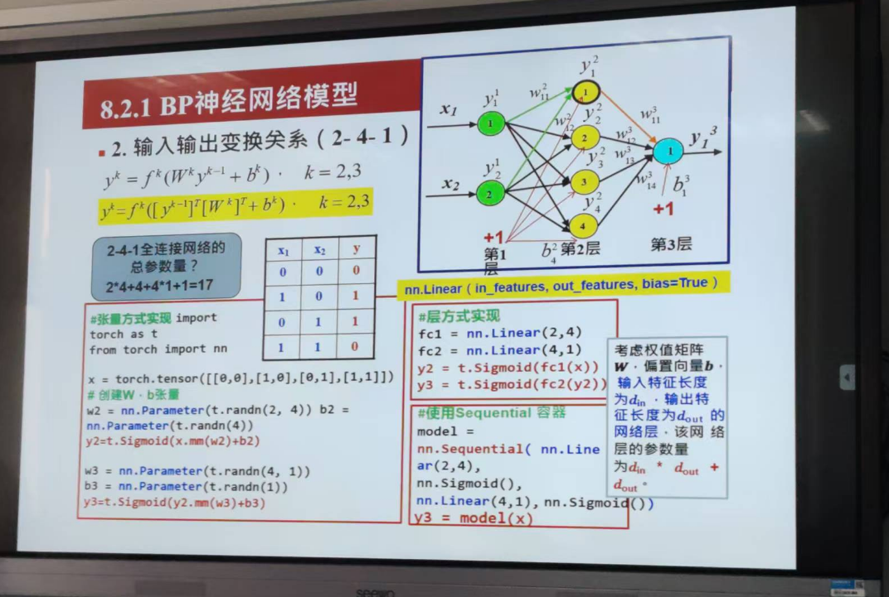

## A 神经元与神经网络

### 1 BP神经网络

wij   i 表示这一层 j表示上一层

### 2 损失函数

- 损失函数 是定义在单个样本上的算是一个样本的误差

- 代价函数 就是所有算是函数的集合

- 目标函数 定义为 最终需要优化的函数 等于 经验风险 和 结构风险 正则化项

### 3 训练和学习的过程

- 正向传播 输入信息 输入层 隐层 输出层

- 反向传播 误差以某种形式在各层表示 修改各层神经元的权值

w = w^t+ α▲

### 4 MLP 多层全连接神经网络

### 5 激活函数

### 6 归一化 Batch Normalization 

### 7 BP 神经网络

- s应层层

- 初始权值的设置

- 训练数据预处理

- 预处理

- 全连接

### 8 例题

---

## B 卷积神经网络

### 感受野

### 局部连接
- 局部连接指的是在卷积层中，每个神经元（或称为“滤波器”）只与输入数据的一个局部区域（称为感受野或局部感受野）相连接，而不是与整个输入层的所有神经元相连接。这种连接方式使得网络能够专注于输入数据的局部特征，如图像中的边缘、角点或纹理等。

### 共享权重
- 共享权重 值得是滤波器 一直都是一个

### 卷积神经网络的计算原理
- 

### 矩阵的卷积 ： 图像矩阵和滤波器对应位置的元素相乘之后的和

### 彩色图片
- 有三张图片 分为 RGB

- 通道数不一样 有三个通道就要有三个不同的卷积和 权重不一样 

- 

- 

